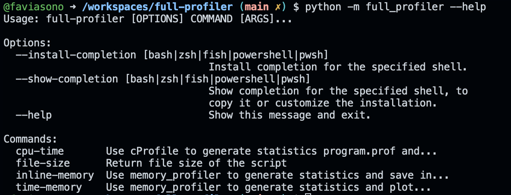

# full-profiler
A simple Python wrapper to profile both memory and time of python scripts in Linux or MacOS.
Quickly built with Typer 🚀💣

## Installation
You need to clone the repo and install in your environment:

```
git clone git@github.com:faviasono/full-profiler.git
cd full_profiler 
pip install .
```

n.b. It's not yet available as wheel package in PyPi.

## Usage
You must run as python module in the following way:

```
python -m full_profiler [ARGS] [OPTIONS]
```

Use the --help flag to see the available commands.For instance, the command `python -m full_profiler --help` will generate the following output:





## TODO

[ ] Get Metrics from  program.prof
[ ] Add results in common folder (handle paths)
